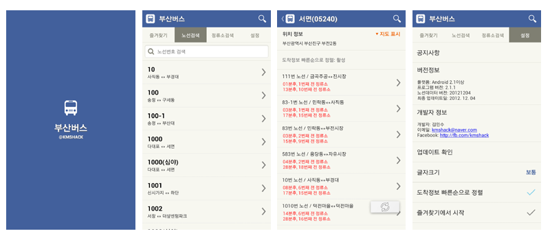

Busanbus for Android
========

부산버스 안드로이드 앱(https://play.google.com/store/apps/details?id=com.kmshack.BusanBus)을 모든 코드를 공개하여 오픈소스화 합니다. 

부산버스 안드로이드 앱의 코드를 공개한 이유는 몇십만 시민이 쓰는 앱을 한사람의 개인개발자가 운영 또는 기능에 대한 의사결한정을 하기에 힘들다고 판단 하였습니다.
또한 코드오픈을 통해 좀더 많은 개발자들이 협력 한다면 더 좋을 앱이 나오지 않을까라는 생각하게 되었습니다.

오픈 소스화는 더 이상 업데이트하지 않겠다는 의미가 아니라 개발자들 또는 사용자분들과 협력하여 더 나은 앱으로 만들어가겠다는 의지임을 알아 주셨으면 좋겠습니다.

라이센스
-----

- 별도로 언급 된 경우를 제외, 부산버스앱은 아파치 라이센스버 2.0버전(http://www.apache.org/licenses/LICENSE-2.0.html)을 기본으로 합니다.
- 누구나 사용뿐만아니라 수정 및 재배포, 2차적인 저작물도 개발 가능합니다. 

데이터 정보
-----

- 정류소 데이터 http://121.174.75.12/02/021.html_ok.asp?m=2&m1=2&bstopnm=
- 실시간 도착 데이터 http://121.174.75.12/01/011.html.asp?m=1&m1=1&bstop_id=172690101&linenm=186&line_id=5200186000
- 기타 추가적인 정보 http://bus.busan.go.kr

주의점 및 참고사항
-----

- 구글 지도는 프로젝트내 string.xml의 google_api_key를 별도로 발급받으셔야 지도가 사용 가능합니다.
- 버스와 노선 관련 데이터파일과 수집 방법에 대한 방법은 database를 참고 하시면 됩니다.
- database/BusData.kms 데이터파일은 sqlite파일이며 2012년 12월을 최신으로 작성된 데이터입니다. 데이터수집 및 작성방법은 database/busanbus_data.xlsx을 확인바랍니다.
- 데이터파일은 앱내에 저장되어 있으며 안드로이드 특성상 데이터를 분할 하여 앱 실행시 다시 합치는 방식으로 앱 분할 방법은 database/datacut 프로젝트를 참고하시기 바랍니다.

추가 문의사항은 이슈게시판 또는 개발자 블로그(http://www.kmshack.kr)에 글을 남겨 주기시 바랍니다.

